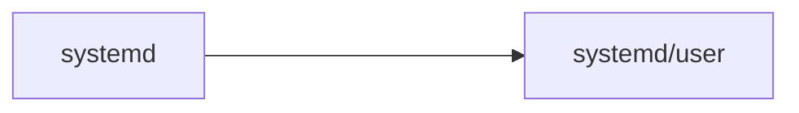

# Scripts
This are my scripts, this is what I think about when I think about home. 

My personal set up is composed by 5 main folders:
- allScripts
- configs
- etc
- systemd
- Unibo
- test [Bonus] 

The `test` folder is not committed and is where i put all my uncompleted projects and features.

## allScripts
Inside `allScripts` there are all the scripts I use for my configuration, hopefully this folder will get heavier.

## configs
Inside `configs` there are all the configurations file necessary for the functioning of OS-related programs, such as the `bashrc` config

## etc
Inside etc there are all the core configurations such as hyprland, waybar and so on. 
This configurations are stowed inside the `$HOME/.config` folder.

## systemd
Insider the systemd folder are located the files necessary for chron jobs.
Right now the only feature are the `gitPull.service` and `gitSync.service`
This are copied inside the `/systemd/user` folder

## Unibo
Inside the `Unibo` folder there is the university certificate to avoid always re-download it from the campus site.
## Installation 
The whole installation process is coordinated by the `install.sh` script. I know, it is messy, I would like to say that it is feature but is not. 